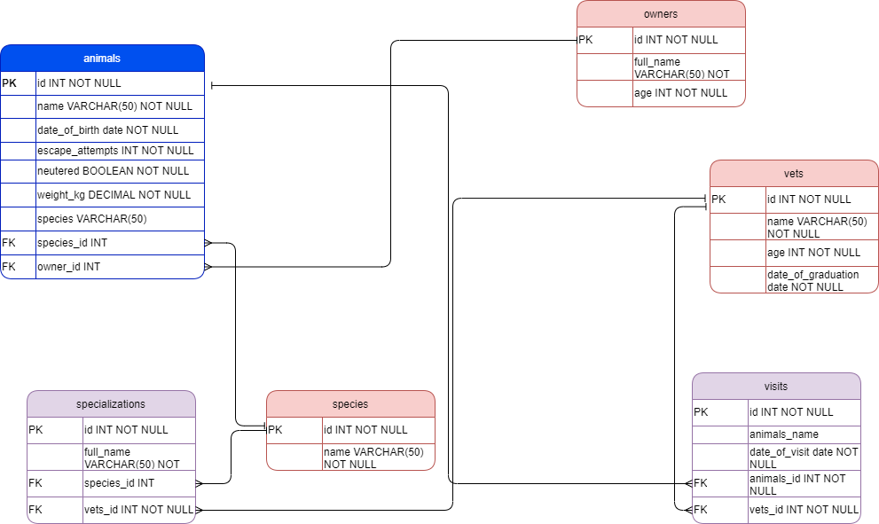

# Vet Clinic

## Schema Diagram for database

## Built With

- PostgreSQL
- SQPL
- psql
- pgAdmin 4

### Setup
- Clone this project and `cd` into the repository folder in the terminal.

## Authors

👤 **Khusiima Luke Masaba**

- GitHub: [@Lucas-Masaba](https://github.com/Lucas-Masaba)
- Twitter: [@MasabaLuke](https://twitter.com/MasabaLuke)
- LinkedIn: [Khusiima Luke Masaba](https://linkedin.com/in/khusiima-luke-masaba)

## 🤝 Contributing

Contributions, issues, and feature requests are welcome!

Feel free to check the [issues page](../../issues/).

## Show your support

Give a ⭐️ if you like this project!

## Acknowledgments

- Hat tip to anyone whose code was used
- Inspiration
- etc

## 📝 License

This project is [MIT](./MIT.md) licensed.
